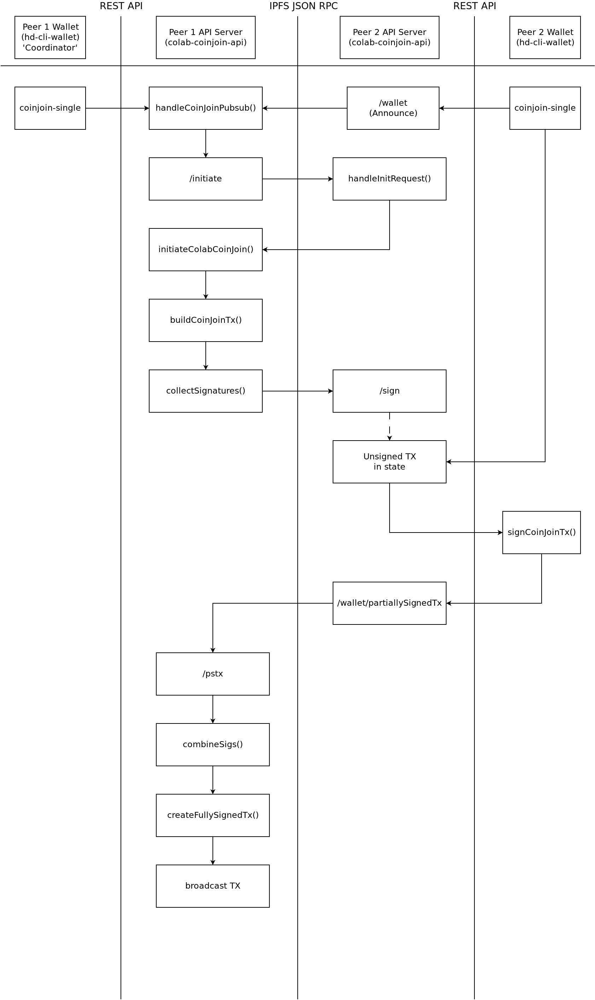

# Developer Documentation

This directory contains documentation and diagrams for developers who want to understand and hack on the code in this repository.

## CoinJoin Flowchart

The flowchart below illustrates how messages are passed between peers to collaborate on a CoinJoin transaction. Each peer has a wallet ([hd-cli-wallet](https://github.com/bch-coinjoin/hd-cli-wallet)) and access to an instance of this colab-coinjoin-api (API server). Wallets and API servers pass information using a REST API. API servers talk to one another using a JSON RPC via [IPFS](https://ipfs.io) pusub channels.

